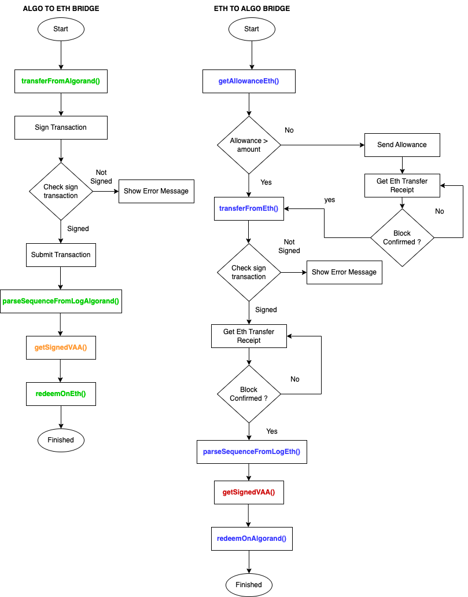

# Messina SDK

Javascript SDK for interacting with Messina Bridge.

## Install

```
npm install @algo-foundry/messina-sdk
```

## Methods and Description

- **Algorand**

  1. _transferFromAlgorand_ => Create a grouped transaction to transfer tokens to the contract on Algorand
  2. _getEmitterAddressAlgorand_ => Get contract emitter address from contract address
  3. _parseSequenceFromLogAlgorand_ => Parses Algorand transaction to get the sequence number
  4. _redeemOnAlgorand_ => Creates a grouped transaction to receive tokens from the contract on Algorand

- **Ethereum**

  1. _getAllowanceEth_ => Gets ERC-20 token spend allowance for contract
  2. _approveEth_ => Initiates transaction to approve contract spend tokens
  3. _transferFromEth_ => Initiates transaction to transfer tokens to the contract on Ethereum
  4. _getEmitterAddressEth_ => Get contract emitter address from contract address
  5. _parseSequenceFromLogEth_ => Parses Ethereum transaction to get the sequence number
  6. _redeemOnEth_ => Initiates transaction to receive tokens from the contract on Ethereum

## Code Flow



## Code Examples

#### Bridging code examples.

1. [Algorand -> Ethereum](docs/examples/src/algo_to_eth.ts)
2. [Ethereum -> Algorand](docs/examples/src/eth_to_algo.ts)
